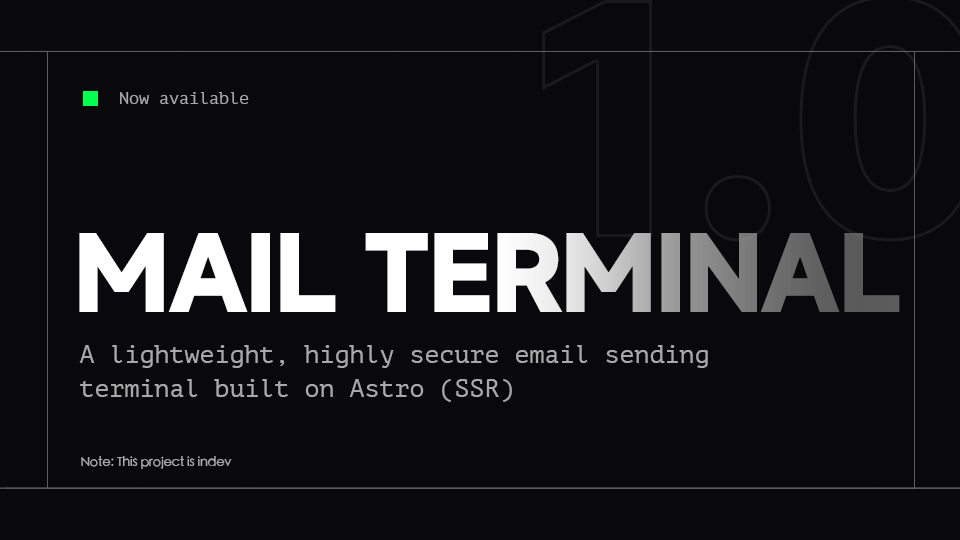

# Tactical Mailer

> 纯粹、无状态的极简主义邮件客户端。

Tactical Mailer 是一款基于 Astro (SSR) 构建的轻量级邮件发送工具。它采用了极其克制的**绝对直角（0px Border-Radius）**设计语言，摒弃了所有多余的视觉装饰，旨在提供类似现代顶尖 SaaS 工具（如 Linear）的纯粹、专注的沉浸式体验。

本项目不依赖任何数据库，是一个纯粹的无状态 SMTP 客户端。即署即用，支持亮/暗色模式无缝切换，并由严格的 JWT 会话管理提供安全保障。



## ✨ 核心特性

- **极简直角美学**：全局 `0px` 圆角约束，现代无衬线字体排版，干净利落的交互响应，提供呼吸感极强的 Workspace 体验。
- **开箱即用的无状态架构**：**零数据库依赖**。没有繁琐的数据库迁移和维护成本，所有配置基于环境变量，即时部署，即时生效。
- **企业级安全隔离**：采用基于 JWT 与 HttpOnly Cookie 的会话控制，所有敏感 SMTP 凭证严格保留在服务端环境，绝不暴露给前端。
- **沉浸式富文本与附件**：内置定制化 React Quill 编辑器（同样适配直角 UI），支持代码块、列表等复杂排版；支持本地文件流式上传（Node.js Buffer）与多附件分发。
- **极致性能**：借助 Astro 的服务端渲染 (SSR) 引擎与 Node.js 适配器，提供极速的首屏加载体验与极低的 API 延迟。

## 🛠 技术栈

- **核心框架**：Astro v5 (Node.js Adapter for vercel)
- **前端视图**：React 18, Tailwind CSS v3
- **后端服务**：Node.js, Nodemailer
- **安全认证**：JSON Web Token (JWT)

## 🚀 快速开始

### 1. 环境准备

确保您的运行环境已安装以下基础依赖：

- Node.js (v18 或更高版本)
- pnpm (推荐的包管理器)

### 2. 安装依赖

```bash
# 克隆项目后，在根目录执行：
pnpm install
```

### 3. 配置系统环境变量

在项目根目录复制或创建 `.env` 文件，并填入您的核心配置。  
*注意：为了兼容 Resend、SendGrid 等现代邮件服务商，我们将“SMTP 鉴权用户”和“实际发件人邮箱”进行了分离。*

```ini
# ==========================================
# 系统安全配置 (System Security)
# ==========================================

# [必填] 用于签名 Cookie 的高强度随机字符串（建议 32 位以上）
JWT_SECRET="complex_random_string_here_32_chars"
#[必填] 用于登录此 Workspace 客户端的独立密码
SYSTEM_PASSWORD="your_secure_password"

# ==========================================
# SMTP 路由配置 (SMTP Routing)
# ==========================================

# SMTP 服务器地址 (如: smtp.resend.com, smtp.gmail.com)
SMTP_HOST="smtp.example.com"
# SMTP 端口 (通常为 465 或 587)
SMTP_PORT=465
# 端口为 465 时设为 true，587 时设为 false
SMTP_SECURE="true" 

# SMTP 鉴权账户 (Resend 等服务通常填固定值，如 "resend")
SMTP_USER="your_smtp_user"
# SMTP 鉴权密码或 API Key
SMTP_PASS="your_smtp_password_or_apikey"

# ==========================================
# 身份展示配置 (Identity)
# ==========================================

# [关键] 实际对外的发件人邮箱地址。
# 注意：若使用第三方服务，此邮箱的域名必须在服务商处完成验证。
SENDER_EMAIL="admin@yourdomain.com"
# 收件人看到的展示名称
SENDER_NAME="Workspace Mailer"
```

### 4. 启动开发环境

```bash
pnpm dev
```

启动后，访问 `http://localhost:4321`，使用您在 `.env` 中配置的 `SYSTEM_PASSWORD` 登入工作区。

### 5. 生产环境构建与部署

本项目原生支持 Node 环境部署。构建完成后，直接运行输出的 server 脚本即可。

```bash
# 构建生产产物
pnpm build

# 启动生产服务
pnpm start
```

## 📄 许可证

本项目基于 [MIT License](./LICENSE) 开源。您可以自由地使用、修改和分发。
